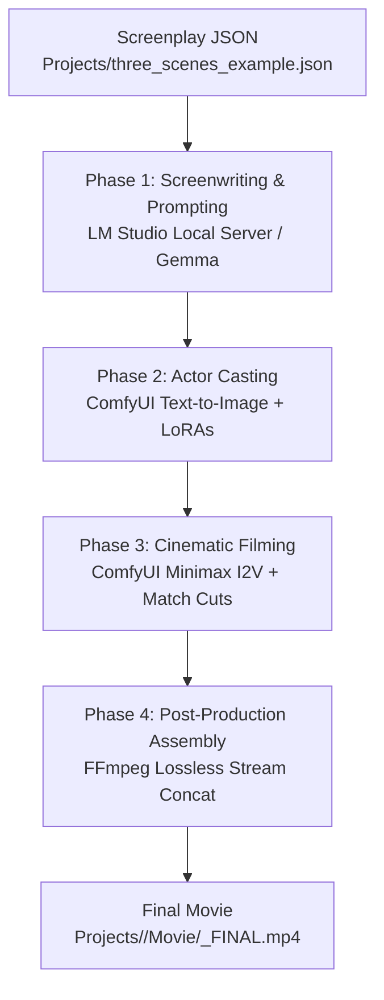
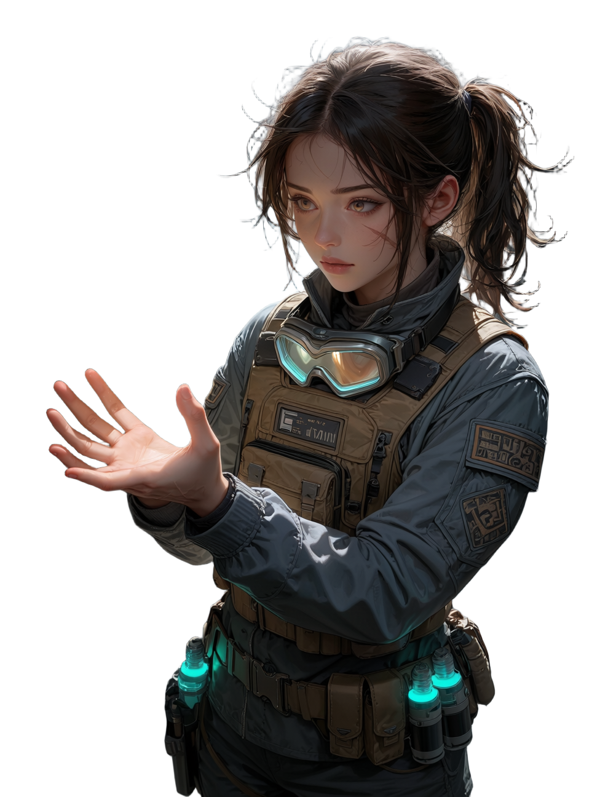
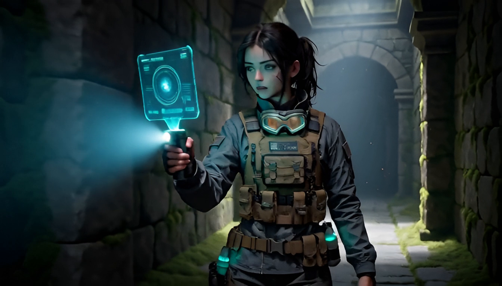
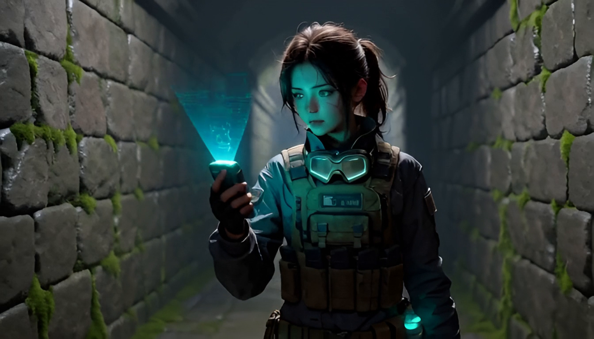
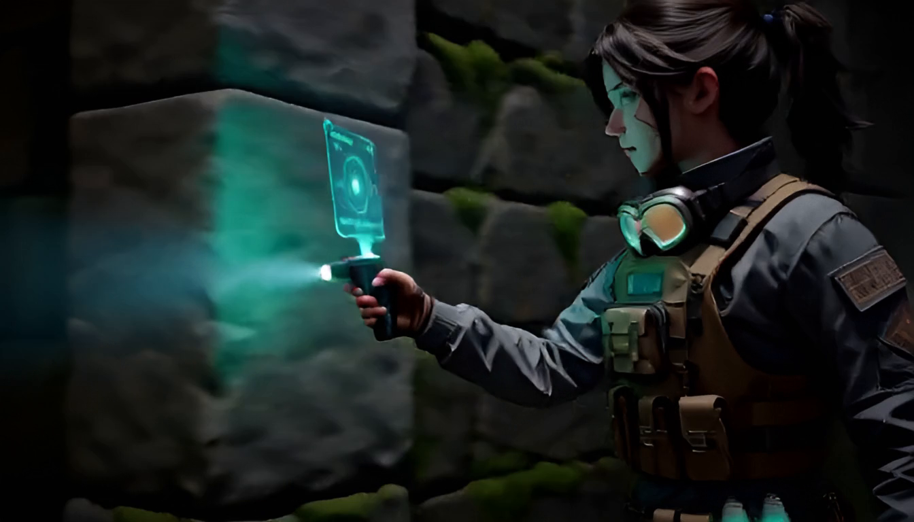

# 🎬 MovieGenerator — Automated End-to-End AI Filmmaking Pipeline

[](https://www.python.org/)
[](https://github.com/comfyanonymous/ComfyUI)
[](https://lmstudio.ai/) (Optional, can be skipped)
[](https://ffmpeg.org/)
[](https://www.gnu.org/licenses/agpl-3.0)

**MovieGenerator** is an autonomous, orchestrating AI film studio designed to convert structured JSON screenplays into complete, seamlessly edited short movies.

It bridges local Large Language Models (via **LM Studio**), diffusion-based character generation with LoRA stacking (via **ComfyUI Text-to-Image**), cinematic multi-modal video generation (via **ComfyUI Minimax Image-to-Video**), and lossless video assembly (via **FFmpeg**).

---

## 📽️ Production Architecture



### Key Highlights

1. **Autonomous Screenwriting (LM Studio)**:
   - Mounts the screenwriter LLM into VRAM (`lms load`) and translates high-level scene concepts into structured cinematic camera directions, lighting cues, and diegetic soundscapes.
   - Automatically unloads the model (`lms unload --all`) once prompting is finished to free up 100% of GPU memory for image/video rendering.
2. **Actor Casting & Identity Consistency (ComfyUI T2I)**:
   - Renders reference portraits for all characters in the screenplay using tailored diffusion models (Anima, Krea 2, CyberRealistic, CatPony, etc.).
   - Chains character-specific LoRAs dynamically, applies trigger words, and caches generated actors so they are reused consistently across multiple films.
3. **Cinematic Continuity & Seamless Match Cuts (ComfyUI Minimax I2V)**:
   - Injects reference images of cast actors so character likeness remains locked across scenes.
   - **Environment Continuity (`anschluss_an_vorherige_szene: true`)**: Feeds the previous shot as a location reference so room architecture and lighting stay identical.
   - **Seamless Match Cuts (`direkter_anschluss: true`)**: Automatically extracts the last frame of the previous scene via FFmpeg/OpenCV and anchors it as `first_frame` guide (`MiniMaxH3AddGuide`). The action continues without jump cuts.
4. **Automated Final Cut (FFmpeg)**:
   - Concatenates all rendered scene clips losslessly into `Projects/<film_name>/Movie/<film_name>_FINAL.mp4`.
5. **Internationalization & Multi-Language UI**:
   - Automatically detects host OS language (with German and English catalogs and English fallback).
6. **Decoupled Settings & Prompt Templates**:
   - Server URLs, ports, and model names are separated into `settings.json`.
   - LLM instructions are modularized as editable templates in `prompts/`.

---

## ⚙️ Prerequisites & System Requirements

| Tool | Purpose | Default Address |
| :--- | :--- | :--- |
| **[ComfyUI](https://github.com/comfyanonymous/ComfyUI)** | Character rendering & Minimax video diffusion | `http://127.0.0.1:8188` |
| **[LM Studio](https://lmstudio.ai/)** | Local LLM prompting (`lms` CLI in system PATH) | `http://127.0.0.1:1234/v1/chat/completions` |
| **[FFmpeg](https://ffmpeg.org/)** | Frame extraction & video concatenation | Available in system PATH |
| **Python** | Runtime engine (Python 3.10 or newer) | Standard libraries only |

> [!TIP]
> **Recommended LLM for LM Studio**: `gemma-4-e4b-uncensored-hauhaucs-aggressive` (or any modern instruction-following model like Llama 3 / Mistral / Qwen).

---

## 🚀 Quickstart

### Method 1: Windows Drag & Drop (Recommended)
Drag any screenplay JSON file (e.g. [`Projects/three_scenes_example.json`](/Projects/three_scenes_example.json)) directly onto `create_movie.bat`.

### Method 2: Interactive Menu
Double-click `create_movie.bat` without arguments. An interactive menu will appear listing all screenplays found in the `Projects/` directory.

### Method 3: Command Line (PowerShell / Terminal)
```bash
python master_regisseur.py Projects/three_scenes_example.json
```

---

## 📂 Project Structure

```text
MovieGenerator/
├── create_movie.bat             # One-click launcher (interactive or drag & drop)
├── master_regisseur.py          # Core film director and pipeline orchestrator
├── settings.json                # User settings (servers, ports, LLM model, language)
├── README.md                    # Main GitHub project documentation (this file)
├── localization/                # Multi-language catalogs
│   ├── de.json                  # German interface
│   ├── en.json                  # English interface (default & fallback)
│   └── __init__.py              # Auto-detection & localization engine
├── prompts/                     # Customizable LLM prompt engineering templates
│   ├── character_casting.txt    # Prompt template for actor casting
│   ├── minimax_scene.txt        # Prompt template for Minimax scene generation
│   ├── continuity_environment.txt # Room/setting continuity instruction
│   └── continuity_matchcut.txt  # Seamless match-cut instruction
├── Presets/
│   └── t2i_presets.json         # T2I base model configs & 100+ curated LoRAs
├── Projects/                    # Screenplay JSONs & generated outputs
│   ├── three_scenes_example.json# Ready-to-render 3-scene demo script
│   └── <film_name>/             # Created automatically during production
│       ├── <film_name>.json     # Extended screenplay (enriched with LM Studio AI prompts)
│       ├── <film_name>_original.json # Pristine backup of original input screenplay
│       ├── Characters/          # Cast reference portraits (<name>.png)
│       ├── Scenes/              # Rendered scene clips (Szene_01.mp4, ...)
│       └── Movie/               # Final movie (<film_name>_FINAL.mp4)
├── Workflows/                   # ComfyUI API workflow graphs
│   ├── workflow_t2i.json        # Character casting workflow
│   └── workflow_i2v_api.json    # Minimax video generation workflow
└── docs/                        # In-depth technical guides
    ├── README.md                # Detailed pipeline & internal documentation
    ├── SCREENPLAY_SPEC.md       # Full JSON screenplay format specification
    ├── PRESETS_AND_LORAS.md     # Catalog of diffusion models & LoRA triggers
    └── LLM_SYSTEM_PROMPT.md     # Ready-to-use prompt for AI scriptwriters
```

---

## 📝 Screenplay Format (Bilingual: English & German)

MovieGenerator supports both English and German syntax interchangeably with 100% backward compatibility. You can write your script in English (`title`, `characters`, `scenes`, `sequence`, `idea`, `duration`) or German (`titel`, `charaktere`, `szenen`, `sequenz`, `idee`, `dauer_sekunden`).

Here is an example screenplay structure ([`Projects/three_scenes_example.json`](Projects/three_scenes_example.json)):

```json
{
  "title": "The Artifact",
  "characters": [
    {
      "id": 1,
      "name": "Maya",
      "model": "anima_cyberrealistic",
      "loras": ["realskin", "anima_detailer"],
      "prompt": "masterpiece, 1girl, 26 years old, ponytail, tactical jacket, techwear vest, simple dark background"
    }
  ],
  "scenes": [
    {
      "id": 1,
      "sequence": "Chamber Discovery",
      "location": "Ancient Temple Corridor",
      "duration": 5,
      "idea": "Maya walks cautiously through a dimly lit ancient stone corridor with a holographic scanner."
    },
    {
      "id": 2,
      "sequence": "Chamber Discovery",
      "same_scene": true,
      "duration": 5,
      "idea": "Reverse angle: Maya spots an elevated stone pedestal across the chamber with a hovering golden artifact."
    },
    {
      "id": 3,
      "sequence": "Chamber Discovery",
      "match_cut": true,
      "duration": 4,
      "idea": "Close-up match cut: Maya's fingers touch the artifact. Radiant blue energy ripples outward across its surface."
    }
  ]
}
```

> [!TIP]
> **Continuity Controls**:
> - `sequence` / `sequenz`: Groups consecutive shots in the same dramatic scene, retaining character end-states and preventing action loops.
> - `same_scene` / `gleiche_szene`: Flags camera angle cuts within the same room/scene.
> - `match_cut` / `direkter_anschluss`: Seamless physical match cut (starts from previous frame).
> - For full schema documentation and all options, see [SCREENPLAY_SPEC.md](docs/SCREENPLAY_SPEC.md).

---

## 🎬 Demonstration & Example Output ("The Artifact")

MovieGenerator includes a full production demonstration in [`Projects/three_scenes_example/`](Projects/three_scenes_example/):

### 📜 Screenplay: Raw vs. AI-Optimized
- 📄 **Original Input Screenplay**: [`Projects/three_scenes_example.json`](Projects/three_scenes_example.json) (Concise human director outline with wardrobe variables and continuity tags)
- 🧠 **AI-Optimized Full Screenplay**: [`Projects/three_scenes_example/three_scenes_example.json`](Projects/three_scenes_example/three_scenes_example.json) (Enriched by LM Studio with multi-shot camera choreography, lighting, diegetic audio instructions, and precise shot timing)

### 🎭 Actor Casting & Final Cut Movie

| Cast Portrait (`Maya`) | Final Cut Movie (`The Artifact`) |
| :---: | :---: |
|  | [](https://github.com/user-attachments/assets/642e358c-1e81-4e83-980e-0d5281da2c3c) |
| **Actor:** Maya (Cyber-Archeologist)<br>**Model:** `anima_cyberrealistic`<br>**LoRAs:** `realskin`, `anima_detailer` | 🎬 **[▶ Watch Final Movie (MP4)](https://github.com/user-attachments/assets/642e358c-1e81-4e83-980e-0d5281da2c3c)**<br>🌐 **[Watch WebM Version](https://github.com/user-attachments/assets/a0d34d43-230b-417d-8a4b-95cf596286d3)**<br>⏱️ Duration: 22s • 1344x768 • Audio & Metadata embedded |

https://github.com/user-attachments/assets/642e358c-1e81-4e83-980e-0d5281da2c3c

### 🎞️ Rendered Scene Storyboard

| Shot 01: Stone Corridor | Shot 02: Hovering Pedestal | Shot 03: Match Cut Activation |
| :---: | :---: | :---: |
| [](https://github.com/user-attachments/assets/53b538de-7e7e-44a4-827b-67faedf3b0f3) | [](https://github.com/user-attachments/assets/71722e45-9e60-491c-a209-973c9e4f981b) | [](https://github.com/user-attachments/assets/4f208e5a-1a07-48f6-8de1-4c910695c4ee) |
| [▶ Watch Scene 01 (MP4)](https://github.com/user-attachments/assets/53b538de-7e7e-44a4-827b-67faedf3b0f3) | [▶ Watch Scene 02 (MP4)](https://github.com/user-attachments/assets/71722e45-9e60-491c-a209-973c9e4f981b) | [▶ Watch Scene 03 (MP4)](https://github.com/user-attachments/assets/4f208e5a-1a07-48f6-8de1-4c910695c4ee) |
| *Environment Setup* | *Continuity Reference (`ref_videos`)* | *Seamless Match Cut (`first_frame` guide)* |

<details>
<summary>🎬 <b>Play Scene Clips Directly (Embedded Players)</b></summary>
<br>

**Scene 01 — Subterranean Vault Discovery:**
https://github.com/user-attachments/assets/53b538de-7e7e-44a4-827b-67faedf3b0f3

**Scene 02 — Hovering Pedestal & HUD Goggles:**
https://github.com/user-attachments/assets/71722e45-9e60-491c-a209-973c9e4f981b

**Scene 03 — Seamless Match Cut Activation:**
https://github.com/user-attachments/assets/4f208e5a-1a07-48f6-8de1-4c910695c4ee

</details>

---

## 🔧 Configuration (`settings.json`)

Adjust your local network addresses and preferences in `settings.json`:

```json
{
  "language": "auto",
  "comfyui": {
    "server_address": "127.0.0.1:8188",
    "models_dir": "D:\\ComfyUI_windows_portable\\ComfyUI\\models",
    "models_search_paths": [
      "../ComfyUI/models",
      "../ComfyUI_windows_portable/ComfyUI/models"
    ]
  },
  "export_webm": true,
  "lm_studio": {
    "url": "http://127.0.0.1:1234/v1/chat/completions",
    "model_name": "gemma-4-e4b-uncensored-hauhaucs-aggressive",
    "temperature": 0.7
  }
}
```

- **`language`**: `"auto"` (detects system language), `"en"`, or `"de"`.
- **`comfyui.server_address`**: Address where ComfyUI is listening.
- **`comfyui.models_dir`**: Path to your ComfyUI models folder (supports absolute or relative paths) to auto-resolve Civitai hashes and companion preview images.
- **`comfyui.models_search_paths`**: Array of relative or absolute fallback paths for automatic discovery in portable setups.
- **`export_webm`**: When `true`, additionally creates a compressed WebM (VP9/Opus) copy of the final film.
- **`lm_studio.model_name`**: LLM identifier to load through `lms load`.

---

## 📚 Documentation Index

For in-depth references, check the `docs/` folder:
- **[Screenplay JSON Specification](docs/SCREENPLAY_SPEC.md)**: Field-by-field reference, data types, and continuity flags.
- **[Presets & LoRA Reference](docs/PRESETS_AND_LORAS.md)**: Catalog of 100+ supported LoRAs and model presets.
- **[LLM System Prompt](docs/LLM_SYSTEM_PROMPT.md)**: Copy-paste system prompt for ChatGPT/Claude/Gemma to write valid screenplays.

---

## 📄 License

This project is licensed under the **GNU Affero General Public License v3.0** (GNU AGPLv3). See the [`LICENSE`](file:///e:/MovieGenerator/LICENSE) file for the full license text.
