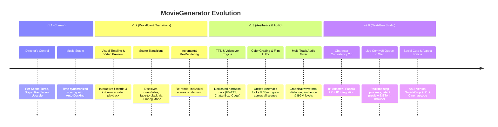

# 🗺️ MovieGenerator & Script Agency — Development Roadmap

This roadmap outlines the strategic development path for **MovieGenerator** and **Script Agency**. It organizes meaningful improvements, quality enhancements, and new feature sets across logical release phases and domain areas.

---

## 🎯 Milestone Overview

---

## 🚀 Phase 1: Workflow & Editing Comfort (v1.2.0)
*Focus: User ergonomics, rapid iteration loops, and cinematic pacing.*

### 1. Incremental Re-Rendering & Smart Cache
* **Challenge:** Modifying a single shot in Scene 4 currently requires re-rendering the entire project or manually manipulating disk files.
* **Solution:**
  * Scene-level fingerprinting using content hashes and timestamps.
  * **`🔄 Re-render This Scene Only`** action button directly on each scene card.
  * Automatic re-stitching of the master film within seconds after any individual scene finishes.

### 2. Visual Storyboard Timeline & In-Browser Video Preview
* **Challenge:** Directors must review the final cut in an external media player rather than inspecting shots directly within Script Agency.
* **Solution:**
  * **Interactive Filmstrip Timeline:** Horizontal scrubber bar displaying shot thumbnails, cumulative duration, and scene boundary markers.
  * **In-Browser Video Playback:** Direct single-click playback of rendered scene `.mp4` files inside the web editor.
  * **Drag & Drop Scene Reordering:** Reorder shots visually with automatic recalculation of timecodes and narrative continuity.

### 3. Cinematic Scene Transitions
* **Challenge:** All shots are currently joined via hard cuts (`Cut`) or direct match-cuts.
* **Solution:**
  * Transition selector per scene:
    * `Hard Cut` (Default)
    * `Cross-Dissolve` (Smooth overlapping blend, 0.5s – 1.0s)
    * `Fade to Black` (Act transitions, passage of time)
    * `Dip to White` (Flashbacks, dream sequences, intense lighting changes)
  * Rendered via FFmpeg `xfade` filter during Phase 5 assembly.

---

## 🎨 Phase 2: Visual Aesthetics & Character Continuity (v1.3.0)
*Focus: Peak visual fidelity, persistent character identity, and color harmony.*

### 1. Character Continuity 2.0 (IP-Adapter / FaceID)
* **Challenge:** Rapid camera movements or novel angles can introduce subtle facial drift away from the master portrait.
* **Solution:**
  * Optional **IP-Adapter FaceID / PuLID** pass inside the ComfyUI pipeline prior to I2V generation.
  * Extracts biometric and structural facial landmarks from `Characters/<Name>.png` to enforce strict identity consistency across all angles.
  * **Multi-Angle Portrait Studio:** Pre-render frontal, 3/4-view, and profile portraits per character to automatically inject the best starting perspective.

### 2. Cinematic Color Grading & 3D LUTs
* **Challenge:** Different diffusion seeds can produce inconsistent color temperatures (e.g., warm daytime in shot 1, cool tint in shot 2).
* **Solution:**
  * Post-processing 3D LUT (Cube LUT) pipeline via FFmpeg:
    * *Teal & Orange* (Modern blockbuster aesthetic)
    * *Bleach Bypass* (High contrast, gritty dramatic look)
    * *Golden Hour / Warm Sunset* (Romantic & coastal warmth)
    * *Noir / Monochrome*
  * Subtle organic 35mm film grain overlay to blend diffusion artifacts and eliminate AI smoothness.

### 3. Frame Interpolation & Slow Motion (RIFE / FILM)
* **Challenge:** Minimax generates at 16 fps or 24 fps. Action beats and emotional pauses benefit from higher frame rates or deliberate slow motion.
* **Solution:**
  * Per-scene toggle: `Slow Motion (50% Speed)` using AI frame interpolation (RIFE / FILM).
  * Smooth 60 fps export option for sweeping panoramic camera motions.

---

## 🎙️ Phase 3: Sound Design & Dedicated Narration (v1.4.0)
*Focus: Multi-track stems, professional voiceover, and layered acoustic depth.*

### 1. Dedicated Voiceover & Narration Engine
* **Challenge:** Minimax generates in-scene dialogue with `<d>...</d>`, but voiceover narration, internal monologue, or documentary-style voice requires precise timestamp synchronization.
* **Solution:**
  * Integration with local high-quality TTS engines (**F5-TTS**, **ChatterBox**, or **Coqui TTS**).
  * Dedicated `voiceover` field per scene: Generates isolated audio stems perfectly mapped to the scene window.

### 2. Multi-Track Audio Mixer in Web Editor
* **Challenge:** Sound effects, dialogue, and music are combined directly into a single master mix.
* **Solution:**
  * Interactive 3-channel mixer in the Script Agency web UI:
    1. **Channel 1: Production Audio** (Minimax dialogue & environmental foley)
    2. **Channel 2: Voiceover / Narration**
    3. **Channel 3: Score / BGM** (with configurable auto-ducking sensitivity)
  * Visual waveform preview with real-time compression ducking curves.

---

## ⚡ Phase 4: Studio Performance & Real-Time Monitoring (v2.0.0)
*Focus: Live feedback loops, multi-format delivery, and resource optimization.*

### 1. Live ComfyUI Render Queue & Latent Preview
* **Challenge:** Progress monitoring currently requires checking terminal logs.
* **Solution:**
  * WebSocket bridge connecting ComfyUI execution events directly to the browser UI:
    * Real-time step counter (e.g., `Step 14 / 20`).
    * Real-time intermediate KSampler latent thumbnail preview.
    * Live ETA countdown and emergency `Cancel Generation` button.

### 2. Multi-Format Social Media Deliverables
* **Solution:**
  * One-click aspect ratio export profiles:
    * **16:9** Widescreen (Cinema & YouTube standard)
    * **9:16** Vertical (TikTok, Instagram Reels, YouTube Shorts) featuring AI smart-crop face tracking to keep actors centered.
    * **21:9** Cinemascope with anamorphic letterboxing.

### 3. Dynamic VRAM & Resource Management
* **Solution:**
  * Automatic checkpoint unload (e.g., Minimax UNet) upon video generation completion to reclaim VRAM for ACE Music generation.
  * Dual-GPU balancing (e.g., GPU 0 dedicated to video diffusion, GPU 1 dedicated to audio & LLM inference).

---

## 📋 Prioritization Matrix

| Feature | Impact & Value | Complexity | Recommended Order |
| :--- | :--- | :--- | :--- |
| **Incremental Scene Re-Rendering** | 🔴 Critical (Massive time saver) | 🟡 Medium | **#1 (v1.2)** |
| **Scene Transitions (`xfade` Dissolve/Fade)** | 🔴 High (Polished cinematic flow) | 🟢 Low | **#2 (v1.2)** |
| **In-Browser Video Player & Filmstrip Timeline** | 🟡 High (Ergonomics) | 🟡 Medium | **#3 (v1.2)** |
| **Cinematic Color Grading & LUTs** | 🟡 High (Visual coherence) | 🟢 Low | **#4 (v1.3)** |
| **Dedicated Voiceover / Narration Engine** | 🟡 High (New narrative formats) | 🟡 Medium | **#5 (v1.3)** |
| **Character Continuity 2.0 (IP-Adapter)** | 🔴 Critical (Facial fidelity) | 🔴 Complex | **#6 (v2.0)** |
| **Live ComfyUI Queue & Latents in Browser** | 🟡 High (Studio UX Polish) | 🟡 Medium | **#7 (v2.0)** |

---
*Roadmap created September 19, 2026 for MovieGenerator Studio.*
