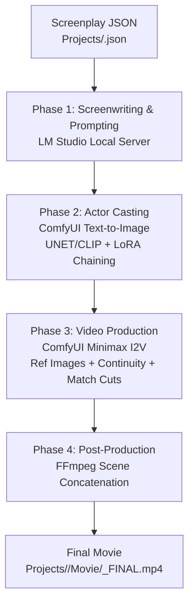

# MovieGenerator — Automated AI Filmmaking Studio

**MovieGenerator** is an automated end-to-end AI filmmaking pipeline that converts structured JSON screenplays into fully rendered short movies. It orchestrates local Large Language Models (via LM Studio), AI image synthesis and character casting (via ComfyUI Text-to-Image), AI cinematic video generation (via ComfyUI Minimax Image-to-Video), and automatic post-production video editing (via FFmpeg).

---

## Architecture & Pipeline Overview

The pipeline is coordinated by `master_regisseur.py` and executes sequentially through distinct production phases:



### Phase 1: Screenwriting & Character Prompting (LM Studio)
- **Model Management**: Automatically instructs LM Studio CLI (`lms load <model>`) to mount the designated LLM in VRAM, and unloads it (`lms unload --all`) immediately after text generation to free maximum GPU memory for ComfyUI.
- **Character Prompt Optimization**: If a character doesn't already have an image or explicit manual prompt lock, the LLM refines the character description into an optimal English visual tag prompt tailored to the chosen diffusion model.
- **Minimax Prompt Engineering**: Translates each scene's narrative idea into structured prompt blocks required by Minimax:
  - `subject_definitions`: Mapping subjects to reference pictures (`<Subject 1> is the character in <Picture 1>`).
  - `summary`: One-sentence English action summary.
  - `detailed_description`: Cinematic camera shot instructions, lighting, and action.
  - `overall_soundscape`: Realistic diegetic environmental audio and foley (strictly no background music).
  - `non_diegetic_music`: Locked to `None` to ensure clean audio stitching during post-production.
  - `DURATION`: Dynamically estimated duration between 3 and 10 seconds.

### Phase 2: Actor Casting (ComfyUI Text-to-Image)
- Checks if a character portrait already exists in `Projects/<film_name>/Characters/<name>.png`. If found, casting is skipped and existing assets are reused for visual consistency.
- If new, loads the designated model preset from `Presets/t2i_presets.json` (e.g. `anima_cyberrealistic`, `krea2_turbo_int8`, `anima_catpony`).
- Dynamically chains `LoraLoader` nodes for all character-specific LoRAs, automatically injects trigger words into the prompt, sets model/clip strengths, and renders reference portraits via ComfyUI API (`http://127.0.0.1:8188`).

### Phase 3: Video Shooting (ComfyUI Minimax I2V)
- Renders each scene using the Minimax video diffusion model via `Workflows/workflow_i2v_api.json`.
- **Character Reference Injection**: Injects all cast character portraits into `ref_images` so Minimax preserves visual identity across shots.
- **Environmental Continuity (`nutze_vorherige_szene: true`)**: Passes the previous scene's video as `ref_video_0` (optimized to 672x384 at 33 frames) so Minimax keeps the lighting, room geometry, and environment consistent.
- **Seamless Match Cut (`direkter_anschluss: true`)**: Automatically extracts the exact last frame of the previous scene via FFmpeg/OpenCV and injects it as `first_frame` guide (`MiniMaxH3AddGuide`). The new scene begins seamlessly where the previous shot ended without jump cuts.

### Phase 4: Assembly & Final Cut (FFmpeg)
- Scans `Projects/<film_name>/Scenes/` for all generated `Szene_*.mp4` clips.
- Stitches the scenes together with frame accuracy using FFmpeg stream concatenation (`-c copy`).
- Outputs the complete movie to `Projects/<film_name>/Movie/<film_name>_FINAL.mp4`.

---

## Directory Structure

```text
e:\MovieGenerator\
├── Film_starten.bat             # Quick launch script (interactive or drag & drop)
├── master_regisseur.py          # Core pipeline director script
├── settings.json                # User settings (e.g. language, server addresses, models)
├── localization/                # Internationalization (i18n) catalogs
│   ├── de.json                  # German localization
│   ├── en.json                  # English localization (default & fallback)
│   └── __init__.py              # Language detection & translation engine
├── prompts/                     # Customizable LLM prompt templates
│   ├── character_casting.txt    # Prompt template for T2I character casting
│   ├── minimax_scene.txt        # Prompt template for Minimax scene generation
│   ├── continuity_environment.txt # Continuity prompt snippet for room/location
│   └── continuity_matchcut.txt  # Continuity prompt snippet for seamless match cuts
├── docs/                        # Complete technical & LLM documentation
│   ├── README.md                # System documentation (this file)
│   ├── SCREENPLAY_SPEC.md       # JSON screenplay specification for LLMs
│   ├── PRESETS_AND_LORAS.md     # Model presets and LoRA catalog
│   └── LLM_SYSTEM_PROMPT.md     # System prompt for LLMs to author scripts
├── Presets/
│   └── t2i_presets.json         # T2I model settings and 104+ curated LoRAs
├── Projects/
│   ├── <film_name>.json         # User screenplay definition files
│   └── <film_name>/             # Generated project assets
│       ├── Characters/          # Cast reference portraits (<char_name>.png)
│       ├── Scenes/              # Rendered video clips (Szene_01.mp4, ...)
│       └── Movie/               # Final stitched film (<film_name>_FINAL.mp4)
└── Workflows/
    ├── workflow_t2i.json        # Base ComfyUI workflow for character generation
    └── workflow_i2v_api.json    # ComfyUI workflow for Minimax video generation
```

---

## System Requirements & Prerequisites

1. **ComfyUI**:
   - Running locally on `127.0.0.1:8188`.
   - Models required:
     - T2I diffusion models / UNETs (Anima, Krea 2, etc.) in `models/diffusion_models` or `models/unet`.
     - CLIP encoders (`qwen_3_06b_base.safetensors`, etc.) in `models/clip`.
     - VAEs (`qwen_image_vae.safetensors`, etc.) in `models/vae`.
     - LoRAs located in `models/loras`.
     - Minimax I2V model in `models/diffusion_models`.
2. **LM Studio**:
   - Local server enabled at `http://127.0.0.1:1234`.
   - CLI tool `lms` available in system PATH.
   - Recommended model: `gemma-4-e4b-uncensored-hauhaucs-aggressive` (configured in `master_regisseur.py`).
3. **FFmpeg**:
   - Available in system PATH for frame extraction and lossless video concatenation.
4. **Python**:
   - Python 3.10+ with standard libraries (`urllib`, `json`, `subprocess`, `shutil`, `re`).

---

## Quickstart & Usage

### Method 1: Drag & Drop (Recommended for Windows)
Drag any screenplay JSON file (e.g. `Projects/first_time.json`) directly onto `Film_starten.bat`.

### Method 2: Interactive Menu
Double-click `Film_starten.bat` without arguments. A terminal window will open listing all available `.json` files in `Projects/`. Enter the number of the screenplay you want to render.

### Method 3: Command Line
Run directly from PowerShell or Command Prompt:
```powershell
python master_regisseur.py Projects/first_time.json
```

---

## Settings & Customization (`settings.json`)

All machine-specific settings are centralized in `settings.json`, allowing you to update `master_regisseur.py` in the future without losing your local configuration:

```json
{
  "language": "auto",
  "comfyui": {
    "server_address": "127.0.0.1:8188"
  },
  "lm_studio": {
    "url": "http://127.0.0.1:1234/v1/chat/completions",
    "model_name": "gemma-4-e4b-uncensored-hauhaucs-aggressive",
    "temperature": 0.7
  }
}
```

- **`language`**: `"auto"` (detects OS UI language), or explicit language code like `"de"`, `"en"`.
- **`comfyui.server_address`**: Host and port of your running ComfyUI instance (default: `127.0.0.1:8188`).
- **`lm_studio.url`**: Local OpenAI-compatible completions endpoint (default: `http://127.0.0.1:1234/v1/chat/completions`).
- **`lm_studio.model_name`**: LLM identifier loaded via LM Studio CLI (`lms load`).
- **`lm_studio.temperature`**: Sampling temperature for creative screenwriting (default: `0.7`).

---

## Customizable LLM Prompts (`prompts/`)

The prompt engineering instructions sent to LM Studio are modularized in the `prompts/` folder:

- **`character_casting.txt`**: Generates high-quality T2I casting prompts tailored to the character's appearance and the target diffusion model. Placeholders: `{char_name}`, `{szenen_uebersicht}`, `{preset_name}`, `{model_desc}`, `{existing_prompt}`.
- **`minimax_scene.txt`**: Expands scene narrative ideas into Minimax prompt blocks (subject definitions, summary, detailed description, soundscape). Placeholders: `{char_definitions}`, `{video_instruction}`, `{idee}`.
- **`continuity_environment.txt`**: Instruction snippet injected when `anschluss_an_vorherige_szene: true` to reference `<Video 1>` for environment continuity.
- **`continuity_matchcut.txt`**: Instruction snippet injected when `direkter_anschluss: true` for seamless match cuts from the previous scene's last frame.

If any prompt file is removed, `master_regisseur.py` automatically falls back to its built-in default instructions.

---

## Documentation Index

- [Screenplay JSON Specification](file:///e:/MovieGenerator/docs/SCREENPLAY_SPEC.md): Complete field reference, data types, continuity options, and validation rules for creating movie scripts.
- [Presets & LoRA Reference](file:///e:/MovieGenerator/docs/PRESETS_AND_LORAS.md): Catalog of all supported base models and 100+ LoRA triggers and weights.
- [LLM System Prompt & Agent Guide](file:///e:/MovieGenerator/docs/LLM_SYSTEM_PROMPT.md): Ready-to-use prompt for Language Models to design consistent, cinematic screenplays.

---

## License

This project is licensed under the **GNU Affero General Public License v3.0** (GNU AGPLv3). See the [`LICENSE`](file:///e:/MovieGenerator/LICENSE) file for details.
