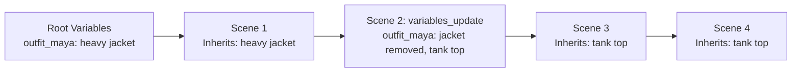

# 🎬 Script Agency — Visual Screenplay Studio & AI Screenwriter

**Script Agency** is MovieGenerator's interactive, browser-based screenplay studio. It pairs a visual, multi-scene storyboarding environment with an intelligent **AI Screenwriter Co-Director** powered by your local LM Studio models.

It allows you to cast actors with tailored LoRAs, structure multi-shot sequences, control camera angle cuts and match cuts, manage persistent wardrobe variables, and collaborate with a local LLM to translate rough ideas into cinematic, production-ready Minimax prompts.

---

## 🚀 Quick Launch

You can launch the Script Agency in three ways:

1. **One-Click Windows Launcher**:
   Double-click `start_script_agency.bat`.
2. **Interactive Main Menu**:
   Double-click `create_movie.bat` and press `[E]` to open the Screenplay Editor. When you close the editor, the menu automatically refreshes.
3. **Command Line (Terminal / PowerShell)**:
   ```bash
   python script_agency.py
   ```

By default, the server runs locally on **`http://127.0.0.1:7860/`** (or increments to `7861`, `7862`, etc. if port 7860 is occupied). It uses standard Python libraries only with zero external pip dependencies.

---

## 🌟 Key Features

### 1. Visual Multi-Scene Storyboard
- **Sequence & Location Bundling**: Group consecutive shots taking place in the same dramatic beat using `sequence` and `location`. This guarantees continuity across cuts.
- **Shot Continuity Badges**:
  - **Match-Cut (`match_cut`)**: Zero-jump-cut physical continuation anchored to the final frame of the previous scene.
  - **Same Scene (`same_scene`)**: Camera perspective switch (over-the-shoulder, reverse-shot, close-up) where characters remain in their established physical postures.
  - **Environmental Continuity (`use_previous_scene`)**: Uses the previous shot video as an environmental lighting and architecture guide.
- **Scene LoRA Picker**: Assign scene-specific Minimax H3 LoRAs (camera motion, martial arts, intimate scenes, film styles) with single-click modal dialogs.
- **Direct Reordering & Duplication**: Move shots up or down, duplicate complex setups, or delete shots.

### 2. Actor Casting & Model Catalog Explorer
- **Preset-Aware LoRA Stacking**: Select any diffusion model (e.g. `anima_cyberrealistic`, `krea2_turbo_int8`, `anima_catpony`). The studio automatically filters and presents only compatible LoRAs from your local ComfyUI model folder.
- **LoRA Trigger Phrases & Strength**: Inspect LoRA descriptions, trigger words, and tweak strength values per actor.
- **Instant Model Re-scan**: Click `🔄 Katalog-Scan` anytime to scan newly downloaded models and LoRAs directly from ComfyUI without restarting.

---

## 🎭 The Dynamic Variable & Wardrobe System (In-Depth Guide)

In multi-scene AI filmmaking, characters frequently change clothes, undress, put on gear, get wet, or pick up props. 

### Why the Variable System is Essential
By default, video diffusion models (like Minimax) reference the static casting portrait (`<Picture X>`) to identify the actor. Without explicit intervention, Minimax will continuously attempt to redraw the original clothing shown in that casting portrait!

The **MovieGenerator Variable System** solves this by maintaining a persistent state machine across all scenes:
1. It separates **Facial Likeness** (anchored by `<Picture X>`) from **Wardrobe & State** (driven dynamically by variables).
2. It tracks wardrobe changes as the film progresses and automatically feeds the active wardrobe into LM Studio and Minimax prompt engineering.



---

### 1. Where to Define Global Variables

#### A. In the Script Agency Web Interface
At the very top of the editor, beneath the title and logline, you will find the **Story-Variablen (Wardrobe / Requisiten / Kontinuität)** card:
- Click **`+ Variable hinzufügen`** to add a new key-value pair.
- Enter the **Key** (variable name) on the left and the **Value** (visual description) on the right.
- To delete a variable, click the trash icon `🗑️`.

#### B. In the Screenplay JSON File
In `Projects/<film_name>.json`, define the initial state inside the root `"variables"` (or German `"variablen"`) dictionary:

```json
{
  "title": "Cyberpunk Protocol",
  "variables": {
    "outfit_maya": "dark tactical field jacket with high collar, grey cargo pants",
    "outfit_kael": "formal charcoal suit with open white collar",
    "scanner_device": "handheld holographic cyan scanning prism",
    "room_lighting": "dim amber mood lighting casting long shadows"
  },
  "characters": [ ... ],
  "scenes": [ ... ]
}
```

#### Best Practices for Variable Naming & Values
| Variable Type | Recommended Key Format | Recommended Value Style (English) |
| :--- | :--- | :--- |
| **Actor Wardrobe** | `outfit_<character_name>` (e.g. `outfit_delia`, `outfit_gunnar`) | Detailed fabric, color, cut, and accessories: `"delicate emerald green silk slip dress, thin shoulder straps, barefoot"` |
| **Props & Tech** | `<prop_name>` (e.g. `scanner`, `crystal_artifact`, `flashlight`) | Physical material, emission color, size: `"heavy metallic datapad with glowing holographic interface"` |
| **Environment / Atmosphere** | `<setting>_<attribute>` (e.g. `lab_lighting`, `weather_state`) | Lighting direction, color temperature, atmospheric density: `"flickering cold cyan neon strobes with drifting mist"` |

> [!TIP]
> **Always write variable values in English!** Diffusion models generate visuals significantly better when guided by descriptive English adjectives rather than brief or German words.

---

### 2. How to Use Variables in Scene Ideas (`{variable_name}`)

Whenever you write a scene description, you can reference any active variable using curly brace placeholders: `{variable_name}`.

#### A. Single-Click Insertion via Web UI Chips
Above each scene's idea textarea, the Script Agency provides interactive variable chips:
```text
[Variablen einfügen:]  [ {outfit_delia} ]  [ {outfit_gunnar} ]  [ {scanner} ]
```
- Click any chip, and `{variable_name}` will be inserted directly at your text cursor position inside the idea box!

#### B. Example in Scene Text
```text
Delia ({outfit_delia}) und Gunnar ({outfit_gunnar}) betreten nervös das Schlafzimmer. Delia hält den {scanner} vorsichtig vor sich.
```

#### How the Engine Processes This:
When you click **"🪄 Elaborate Idea"** (or during production with `master_regisseur.py`):
1. The engine checks the current active value of `{outfit_delia}` and `{outfit_gunnar}`.
2. It instructs LM Studio to explicitly describe the actors in these exact garments in `[Shot 1]`, forcefully instructing Minimax to override the clothing from the casting picture (`<Picture X>`).

---

### 3. How to Update Variables in a Scene (`variables_update`)

When an action causes a character to undress, change clothes, or alter their state (e.g. taking off a coat, getting drenched in rain, or unbuttoning a shirt), you record this change directly on that specific scene.

#### A. In the Script Agency Web Interface
Each scene card contains a dedicated input field:
**`Variablen Update in dieser Szene`**

You can enter updates in three different ways:

1. **Simple Key-Value Shorthand** (Most convenient):
   ```text
   outfit_delia: nightgown slipped off shoulders, wearing black lace lingerie
   ```
2. **Standard JSON Object**:
   ```json
   {"outfit_delia": "nightgown slipped off shoulders", "outfit_gunnar": "shirt unbuttoned"}
   ```
3. **🪄 AI-Assisted Auto-Suggestion**:
   Click the magic wand button **`🪄 Vorschlag für Variablen`** right next to the header. LM Studio will analyze the scene text, detect any wardrobe or prop changes mentioned in the idea, and automatically populate the update!

#### B. In the Screenplay JSON File
Add `"variables_update"` (or `"variablen_update"`) to the scene object:

```json
{
  "id": 4,
  "sequence": "Bedroom Intimacy",
  "location": "Master Bedroom",
  "idea": "Delia slowly unties Gunnar's shirt and slips it off his shoulders.",
  "variables_update": {
    "outfit_gunnar": "shirt removed, bare chest, dark trousers"
  },
  "same_scene": true
}
```

---

### 4. The State Machine: Automatic Inheritance Across Scenes

Variables updated in a scene are **not** one-shot; they alter the persistent story timeline:

| Scene | Action | Active Wardrobe State |
| :--- | :--- | :--- |
| **Scene 1** | Gunnar enters the house. | `outfit_gunnar`: `"formal black suit with tie"` *(Inherited from Root)* |
| **Scene 2** | Gunnar takes off his jacket and loosens tie. | `variables_update`: `{"outfit_gunnar": "jacket removed, loosened tie, rolled-up sleeves"}` |
| **Scene 3** | Gunnar sits on the couch drinking coffee. | `outfit_gunnar`: `"jacket removed, loosened tie, rolled-up sleeves"` *(Automatically inherited from Scene 2!)* |
| **Scene 4** | Gunnar unties his tie and unbuttons shirt. | `variables_update`: `{"outfit_gunnar": "tie removed, white shirt completely unbuttoned"}` |
| **Scene 5** | Gunnar walks onto the terrace. | `outfit_gunnar`: `"tie removed, white shirt completely unbuttoned"` *(Automatically inherited from Scene 4!)* |

> [!IMPORTANT]
> You only need to specify `variables_update` when an actual change occurs! All subsequent shots naturally retain that new state until another update is triggered.

---

### 5. Summary Cheat Sheet: Where to Write What

| Component | UI Location in Script Agency | JSON Key | Format & Syntax | Example |
| :--- | :--- | :--- | :--- | :--- |
| **Initial Global State** | Top bar under "Story-Variablen" | `"variables": { ... }` | `Key: Value` dictionary | `"outfit_maya": "white silk dress"` |
| **In-Line Reference** | Inserted via chips into Idea box | Inside `"idea"` string | `{key_name}` with curly braces | `"Maya ({outfit_maya}) walks..."` |
| **Scene Wardrobe Change** | "Variablen Update in dieser Szene" field | `"variables_update": { ... }` | `key: new_value` or `{"key": "new_value"}` | `outfit_maya: dress removed, barefoot` |
| **AI Prompt Generation** | Generated via `🪄 Elaborate Idea` | Stored in `"idea"` or shot prompt | Standard Minimax block (`summary:`, `detailed_description: [Shot 1]`, etc.) | Auto-generated by LM Studio |

---

## 🤖 AI Screenwriter & Co-Director (LM Studio Integration)

The studio connects directly to your local **LM Studio** server (`http://127.0.0.1:1234/v1/chat/completions`) to act as your autonomous screenwriting assistant.

### 🪄 1. Elaborate Scene Idea (`btn-ai-elaborate-scene`)
Turns a short idea or director note (in German or English) into an official, multi-part Minimax prompt block:

- **`summary:`**: Concise one-sentence action summary in English.
- **`detailed_description:`**: Cinematic medium/close-up shot description with 35mm film aesthetics, lighting, and camera movement.
- **`overall_soundscape:`**: High-fidelity diegetic ambient acoustics, foley, breathing, and dialogue.
- **`non_diegetic_music: None`**: Strictly excludes background music so audio can be spliced losslessly during post-production.
- **`DURATION: X`**: Dynamically estimated duration between 3 and 15 seconds.
- **`LORAS:`**: Auto-selected matching Minimax LoRAs from your local catalog.

#### 🧠 Grounded in Project Documentation (`docs/`)
The AI Screenwriter dynamically loads and references:
- **`docs/LLM_SYSTEM_PROMPT.md`**: Technical constraints, dynamic variables, and continuity rules.
- **`prompts/minimax_scene.txt`**: Audio, subject tagging, and camera instructions.

#### 🎞️ Context-Aware Shot Continuity
When elaborating a shot, the AI Screenwriter ingests the **preceding shots in the screenplay**—especially shots sharing the same `sequence` or `location`. If a previous shot established that characters were standing near a bed, the new shot naturally continues from that exact physical posture without having them walk into the room again or re-initiate already completed actions!

#### 🏷️ Mandatory Subject Tagging (`<Subject X>`)
The engine maps character names to `<Subject X>` tags bound to casting portraits (`<Picture X>`), ensuring Minimax preserves facial identity and visual consistency across cuts.

---

### 💡 2. Suggest Next Scene (`btn-ai-suggest-scene`)
Brainstorms the next dramatic beat in the screenplay. It analyzes:
- The overall movie title and logline description.
- Active cast members.
- Global variables and props.
- The preceding 4 shots in the film.
- Produces a logical next scene object complete with sequence title, location, estimated duration, participating actors, and narrative idea.

---

### 🪄 3. Suggest Scene Variables (`btn-ai-suggest-scene-vars`)
Analyzes the scene's action to detect whether any character changed clothes, removed an item, or altered appearance, and suggests clean `variables_update` dictionary keys without hallucinating unrelated props.

---

## 🛡️ Reasoning Model Support & Hardened Sanitization

Modern local LLMs (e.g. `gemma-4-e4b-uncensored`, `DeepSeek-R1`, `Qwen-QwQ`) produce extensive internal reasoning / Chain-of-Thought (*"Here's a thinking process to construct the prompt: 1. Analyze the request..."*).

Script Agency incorporates specialized safeguards for reasoning models:
1. **Generous Token Budgets (4000+ Tokens)**:
   Reasoning models share token limits between internal thinking and final output. Script Agency provides 4000+ tokens to ensure the model finishes thinking and completes the prompt.
2. **Hardened Post-Processing (`clean_elaborated_prompt`)**:
   - Strips all internal thinking traces, preambles, and conversational intros before `summary:`.
   - If a model's generation is truncated or halts inside reasoning, the engine extracts the drafted camera action and synthesizes a valid, clean Minimax prompt block.
   - **Zero reasoning leaks into your screenplay!**

---

## 🔌 REST API Endpoints

The `script_agency.py` server exposes lightweight JSON endpoints:

| Endpoint | Method | Purpose |
| :--- | :--- | :--- |
| `/api/projects` | `GET` | Lists all screenplay projects in `Projects/`. |
| `/api/project/load?name=<file>` | `GET` | Loads screenplay JSON with automatic backup creation. |
| `/api/project/save` | `POST` | Saves screenplay JSON with atomic write and `.bak` safety backup. |
| `/api/presets` | `GET` | Returns diffusion presets, models, and compatible LoRA catalog. |
| `/api/catalog/rescan` | `POST` | Triggers background model/LoRA scan via `catalog_builder.py`. |
| `/api/llm/status` | `GET` | Checks if LM Studio is online and reports the active model. |
| `/api/llm/generate` | `POST` | Handles AI generation tasks (`elaborate_scene`, `suggest_scene`, `suggest_variables`). |
| `/api/shutdown` | `POST` | Gracefully shuts down the web server and releases port. |

---

## 💡 Best Practices

1. **Bundle Scenes by Sequence**:
   Give consecutive shots the same `sequence` name (e.g. `Bedroom Talk`, `Car Chase`). The AI Screenwriter and Minimax will both maintain tight environmental and posture continuity.
2. **Use Variables for Wardrobe Changes**:
   Whenever a character changes clothes, use the **`variables_update`** field on that scene. Minimax will override the casting portrait's original outfit and lock the new clothing in place.
3. **Review Continuity Toggles**:
   - Use **Same Scene** when changing camera angles within the same room.
   - Use **Match-Cut** when continuing an uninterrupted physical motion (e.g. reaching for an object, throwing a punch).
4. **Export & Render**:
   Once your screenplay is ready in the Script Agency, simply click save, close the editor, and run `create_movie.bat` to launch full autonomous rendering!
